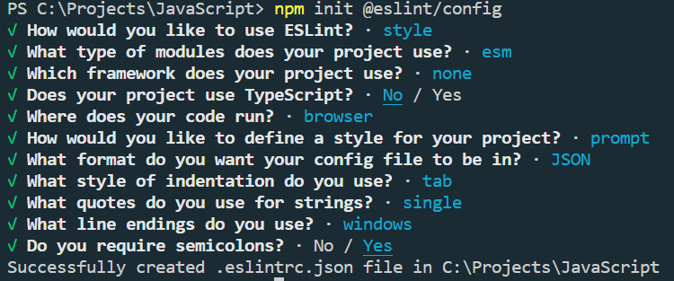

# 1. Основы JavaScript

## Содержание

[1 Подготовка к работе](#1-подготовка-к-работе)<br>
[1.1 Конфигурация VSCode](#11-конфигурация-vscode)<br>
[1.2 Конфигурация ESInt](#12-конфигурация-eslint)<br>
[2 Основы JavaScript](#2-основы-javascript)<br>
[2.1 Команды](#21-команды)<br>
[2.2 Функции, стрелочные функции](#22-функции-стрелочные-функции)<br>
[2.3 Методы и свойства строк и чисел](#23-методы-и-свойства-строк-и-чисел)<br>
[2.4 Callback функция](#24-callback-функция)<br>
[2.5 Объекты, деструктуризация объектов](#25-объекты-деструктуризация-объектов)<br>
[2.6 Массивы и псевдомассивы](#26-массивы-и-псевдомассивы)<br>
[2.7 Копирование объектов](#27-копирование-объектов)<br>
[2.8 Копирование массивов](#28-копирование-массивов)<br>
[2.9 Объектно-ориентированное програмирование](#29-объектно-ориентированное-програмирование)<br>
[2.10 Динамическая типизация](#210-динамическая-типизация)<br>
[2.11 Получение элементов со страницы](#211-получение-элементов-со-страницы)<br>
[2.12 Работа с элементами на странице](#212-работа-с-элементами-на-странице)<br>
[2.13 События и их обработчики](#213-события-и-их-обработчики)<br>
[2.14 Навигация по DOM - элементам, data-атрибуты, преимущество for/of](#214-навигация-по-dom---элементам-data-атрибуты-преимущество-forof)<br>
[2.15 Рекурсия](#215-рекурсия)<br>
[2.16 События на мобильных устройствах](#216-события-на-мобильных-устройствах)<br>
[2.17 Async, defer, динамические скрипты](#217-async-defer-динамические-скрипты)<br>

## 1 Подготовка к работе

### 1.1 Конфигурация VSCode

It is usefull to confugurate IDE.
It needs some plugins:

- All autocomplete
- Auto Close Tag
- Auto Complete Tag
- Code Runner
- Import Cost
- JavaScript (ES6) code snippets
- Live Server
- Sass
- Theme — Oceanic Next
- VSCode-icons
- React code snipped
- jshint
- ESLint

Manager of packages npm. Needs to install Node.js from official site nodejs.org.

### 1.2 Конфигурация ESlint

1. Установить плагин ESLint ([ESLint dokumentation](https://eslint.org/)).

1. Сначала нужно инициализировать весь проект.

`npm init`

2. Запускаем конфигурацию ESlint


`npm init @eslint/config`

3. Ответить на ряд вопросов, например



2 Атвоматическое форматирование при сохранении файла:

- settings -> Editor format on save

            -> default formatter
            
            -> settings JSON 

## 2 Основы JavaScript

### 2.1 Команды

|Comands|Description|
|-:|:-|
|console.log()|Вывод в консоль|
|alert()|Вывод на экран в выпадающее окно|
|confirm()|Выпадающее окно да/нет -> результат boolean|
|prompt('текст', '\<placeholder>')|Выпадающее окно с текстом наример вопрос с выбором вариантов ответов и строкой ввода. Результат текст введеный в строке ввода.|
|typeof(var)|Проверяет тип данных|
|document.write()|Выписывает какие-то данные прямо на странице|
|${*some_variable*}|Интерполяция - динамическое использование переменных, констант|

### 2.2 Функции, стрелочные функции

Синтаксис:

Сначала пишется ключевое слово **function** мы говорим, что это функция. После идет какое-то название, например *showFirstMessage**. Потом идут фигурные скобки - тело функции. Там прописываются какие-то действия. Чтобы она заработала, ее необходи вызвать. Мы обращаемся к имени функции и стивим круглые скобки.

В функцию могут быть переданы какие-то параметры, которые данная функция будет использовать внитри себя. Функция может менять значение глобальной переменной. Замыкание функции - функция приобработке переменных ищет эти переменные сначала внутри себя, ели не находит, идет на уровень выше, и т.д. Замыкание функции - это сама функция вместе со всеми переменными, которые ей доступные.

Возвращение значения функцией:

```JavaScript
function calc(a, b) {
    return (a + b);
}
```

Классификация функций:


### 2.3 Методы и свойства строк и чисел

[Документация по JavaScript](https://learn.javascript.ru/)

|Метод|Описание|
|-:|:-|
|str.length|Длина строки|
|arr.length|Длина массива|
|str[2]|Получение элемента по индексу|
|str.toUpperCase()|Преобразовать строку в заглавные буквы. Возвращает новое значение|
|str.toLowerCase()|Преобразовать строку в нижний регистр. Возвращает новое значение|
|str.indexOf("substring")|Выводит индекс позиции, с которой начинается это слово переданное в параметре метода|
|str.slice(6, 11)|Выводит на экран кусок строки. Первый параметр - с какого индекса начинать, второй параметр - по какой индекс вырезать|
|str.substring(6, 11)|Выводит на экран кусок строки. Первый параметр - с какого индекса начинать, второй параметр - по какой индекс вырезать. Не поддерживает отрицательныйе значения параметров в отличии от `slice()`|
|str.substr(6, 11)|Выводит на экран кусок строки. Первый параметр - с какого индекса начинать, второй параметр - длина строки, количество символов.|
|str.trim()|Отрезает пробелы в строке|
|Math.round(num)|Округление числа до ближайшего целого|
|parseInt(str)|Парсование целого числа из начала и конца строки|
|parseFloat(str)|Парсование числа с плавающей точкой из строки|

### 2.4 Callback функция

Callback - это функция, которая должна быть выполнена после того, как другая функция завершила свое выполнени.

Главный шаблон callback функции:

```JavaScript
function learnJS(lang, callback) {
    console.log(`I learn: ${lang}`);
    callback();
}

function done() {
    console.log('I finish this class');
}

learnJS('JavaScript', done);
```

### 2.5 Объекты, деструктуризация объектов

Создание объекта:

```JavaScript
const options = {
    name: 'test',
    width: 1024,
    hegth: 1024,
    colors: {
        border: 'black',
        bg: 'red;
    },
    makeTest: function() {
        console.log('test');
    }
};

//Запуск метода, встроенного в объект
options.makeTest();
```

Удаление поля из объекта:

```JavaScript
delete options.name;
```

Просмотр свойств (полей объекта):

```JavaScript
for (let key in options) {
    if (typeof(options[key]) === 'object') {
        for (let i in options[key]) {
            console.log(`Option ${i} has value ${options[key][i]}`);
        }
    } else {
        console.log(`Option ${key} has value ${options[key]}`);
    }
};
```

У объекта есть метод (часто используемый) **Оbject.keys()** - выводит количество полей объекта.

```JavaScript
Object.keys(options).length;
```

**Деструктуризация объекта:**

```JavaScript
const {border, bg} = options.colors;
console.log(border);
console.log(bg);
```

### 2.6 Массивы и псевдомассивы

Метод для работы с концом массива:

```JavaScript
const arr = [1, 2, 3, 5, 8, 9];
arr.pop(); //удаляет последний элмент массива
arr.push(10); //добавляет элемент в конец массива
```

Существуют методы для вставки и удаления элементов в начало масива, это методы **shift()** и *unshift()**. Но из-за того, что при вставке и удалении элементов приходится менять нумерацию индексов всех элементов (что занимает много времени), эти методы практически не используются.

Для перебора всех элементов масива используется чаще всего цикл **for(){}**:

```JavaScript
for (let i = 0; i < arr.length; i++) {
    console.log(arr[i]);
}
// можно еще использовать такой цикл для перебора элементов
for (let value of arr) {
    console.log(value);
}
```

Метод массива **forEach()** принимает параметром callback функцию:

```JavaScript
arr.forEach(function(element, i, arr) {
    console.log(`${i}: ${element} inside array ${arr}`);
});
```

Сallback функция может принимать 3 аргумента:

1. Первый аргумент - это тот злемент, который мы сейчас перебираем.
2. Второй аргумент - номер по порядку.
3. Третий аргумент - ссылка на массив, который мы перебираем.

Методы Объекта и массива


[Отличия for...of от for...in](https://developer.mozilla.org/ru/docs/Web/JavaScript/Reference/Statements/for...of#%D1%80%D0%B0%D0%B7%D0%BB%D0%B8%D1%87%D0%B8%D1%8F_%D0%BC%D0%B5%D0%B6%D0%B4%D1%83_for...of_%D0%B8_for...in)

Методы **split(), join(), sort()**

Метод **split()** разделяет одну строку по какому-то делимитеру, и создает массив отдельных слов.

```JavaScript
const str = prompt('', '');
const products = str.split(', ');
```

Метод **join()** - это обратная операция, т.е. на основе массива строк создает целое предложение.

```JavaScript
const str = prompt('', '');
const products = str.split(', ');
console.log(products.join('; '))
```

Метод **sort()** - это метод сортировки. Сортирует все как строки, по первому символу.

```JavaScript
const str = prompt('', '');
const products = str.split(', ');
products.sort();
console.log(products.join('; '))
```

Данный метод может принимать callback функцию, в которой можно указать, как должна выполняться сортировка.

```JavaScript
const arr = [1, 2, 4, 6, 10];
arr.sort(compareNum);
console.log(arr);

function compareNum(a, b) {
    return a - b;
}
```

[Алгоритм быстрой сортировки](https://algolist.ru/sort/quick_sort.php)

Псевдомассивы - это объект, структура которого совпадает со структурой массива, но у таких псевдомассивов нет никаких методов.
[Алгоритмы поиска на JavaScript](https://web.archive.org/web/20221025084508/http://mathhelpplanet.com/static.php?p=javascript-algoritmy-poiska)

### 2.7 Копирование объектов

1. В простейшем варианте копирование оюъектов можно сделать через функцию - поверхностная копия (меняет значение переменых во вложенных объектах копии и родителя):

```JavaScript
function copy(mainObj) {
    let objCopy = {};
    
    for (let key int mainObj) {
        objCopy[key] = mainObj[key];
    }
    return objCopy;
}

const numbers = {
    a: 2,
    b: 5,
    c: {
        x: 7,
        y: 4
    }
};
const newNumbers = copy(numbers);
```

2. Object assign:

Позволяет соединить сразу несколько объектов, например вложить один объект в другой объект. Создает новую независимую поверхностную копию объекта.

```JavaScript
const add = {
    d: 17,
    e: 20
};
//первый аргумент - объект, в который мы хотим все это поместить
//второй аргумент - объект, который мы помещаем
Object.assign(numbers, add);
```

### 2.8 Копирование массивов

```JavaScript
const oldArray = ['a', 'b', 'c'];
const newArray = oldArray.slice(); //скопирует старый массив в новый
```

Оператор **Spread()**(...\<someArray>) - оператор разворота, разворачивает структуру и превращает ее в набор каких-то данных.

```JavaScript
const video = ['youtube', 'vimeo', 'rutube'],
      blogs = ['wordpress', 'livejornal', 'blogger'],
      internet = [...video, ...blogs, 'vk', 'facebook'];
```

Использование оператора **Spread()** для разворачивания объектов.

```JavaScript
const array = ['a', 'b'];
const newArray = [...array];

const q = {
    one: 1,
    two: 2
};

const newObj = {...q};
```

### 2.9 Объектно-ориентированное програмирование

У нас есть какой-то базовый объект - прототип.

```JavaScript
const soldier = {
    health: 400,
    armor: 100,
    sayHello: () => {
        console.log('Hello');
    }
};
```

1. Создание объекта нв основе прототипа:

```JavaScript
const john = Object.create(soldier);
```

Здесь при создании объекта мы вызываем метод **create()**, и в качестве параметра указываем прототип объекта, т.е. родитель нового объекта.

2. Установка прототипа новому объекту:

```JavaScript
Object.setPrototype(john, soldier);
```

Вызываем метод **setPrototype()**, в качестве параметров указываем новый созданный объект, второй параметр - прототип нового объекта.

### 2.10 Динамическая типизация

Динамическая типизация - превращение одного типа данных в другой, например числовой тип в строковый и наоборот.

1. To String

```JavaScript
//1) оборачивание
String(6);

//2)конкатенация
console.log(6 + '');

const num = 5;
console.log("https://vk.com/catalog" + num);

const fontSize = 26 + 'px';
```

2. To number

```JavaScript
//1) оборачивание
Number('6');

//2) унарный плюс
console.log(+'5');

//3) парсинг
parseInt('15px', 10);
```

3. To boolean

```JavaScript
// 0, '', null, undefined, NaN; => false
```

### 2.11 Получение элементов со страницы

DOM - **D**ocument **O**bject **M**odel объектная модель документа. Глобалный объект, есть свои методы.

Чтобы обратиться к DOM нужно использовать использовать сущность, которая называется **document**:

```JavaScript
//1. Создаем вместилище информации. 
//Обращение к документу и ролучение элемента по его ID со страницы
const box = document.getElementById('box');

//2. Получаем все кнопки по тэгу
// Получили псевдомассив
const  btns = document.getElementByTagName('button');
```


```JavaScript
//Обращение к какой-то конкретной кнопке
const  btns = document.getElementByTagName('button')[1];

//или
const  btns = document.getElementsByTagName('button');
console.log(btns[1]);

//3. Получение элементов по классу.
// Также получаем массив элементов
const circles = document.getElementsByClassName('circle');

//4. Получение элементов по CSS селектору - более современный способ
// Получаем коллекцию
const hearts = document.querySelectorAll('.heart');

//5. Получение одного элемента по CSS селектору
// Возвращает первый попавшийся элемент.
const oneHeart = document.querySelector('.heart');
```

### 2.12 Работа с элементами на странице

```JavaScript
//1. Поменять свойства у определенного элемента
box.style.backgroundColor = 'blue';
box.style.width = '500px';

box.style.cssText = 'background-color: blue; width: 500px';

btns[1].style.borderRadius = '100%';

//2. Поменять свойства у нескольких элементов
for (let i = 0; i < hearts.length; i++) {
    hearts[i].style.backgroundColor = 'blue';
}

//Специально перебирающие элементы
hearts.forEach(item => {
    item.style.backgroundColor = 'blue';
});
```

***Основные методы для работы с элементами страницы***
Очень часто части сайти генерируются с помощью JS, на таком принципе построен React. ДЛ этого используется метод **document.createElement()**.

```JavaScript
//Параметр - элемент, который создается.
//Таким способом моздается элемент, который сущестыует только внутри скрипта
const div = document.createElement('div');
// Таким же образом создаются и текстовый узлы
const text = document.createTextNode('Тут был я');

//Теперь мы можем этот элемент застилизовать. 
// Существует следующий способ, но не рекомендуется, потому что устаревший
div.className('black');

//Вместо этого рекомендуется использовать другой новейший способ
div.classList.add('black');

//Добавление элемента на страницу - через дерево DOM
document.body.append(div); //Вставка элемента в конец страницы
document.querySelector('.wrapper').append(div); //вставка элемента внутрь какого-то класса
document.querySelector('.wrapper').prepend(div); //вставка элемента в начало какого-то класса
hearts[0].before(div); //вставка элемента перед каким-то другим элементом
hearts[0].after(div); //вставка элемента после какого-то дугого элемента
circles[0].remove(); //удаление элемента со страницы
hearts[0].replaceWith(circles[0]); //замена одного элемента другим
```

Устаревшие конструкции:

```JavaScript
document.body.appendChild(div); //Вставка элемента в конец страницы
wrapper.insertBefore(div, hearts[0]); //вставка элемента, первый параметр - какой элемент вставляем, второй - перед каким элементом вставляем
wrapper.removeChilde(hearts[1]); //удаление элемента со страницы, у родителя wrapper удалить элемент hearts[1]
wrapper.replaceChild(circles[0], hearts[0]);//замена одного элемента circles[0] другим hearts[0]
```

Добавление текста или html кода прямо в элементы:

```JavaScript
div.innerHTML = "Hello World"; //вставка текста в элемент страницы
div.innerHTML = "<h1>Hello World</h1>"; //вставка текста в элемент страницы в HTML элемент
div.textContent = "Hello";//вставка текста в элемент страницы, работает только с текстом
div.insertAdjacentHTML('beforebegin', '<h2>Hello</h2>');//вставка текста перед началом элемента
div.insertAdjacentHTML('afterbegin', '<h2>Hello</h2>');//вставка текста внутри элемента вначале
div.insertAdjacentHTML('beforeend', '<h2>Hello</h2>');//вставка текста внутри элемента перед концом элемента
div.insertAdjacentHTML('afterend', '<h2>Hello</h2>');//вставка текста внутри элемента после конца элемента
```

### 2.13 События и их обработчики

1. Пример оформления обработчика событий, ***КРАЙНЕ НЕ РЕКОМЕНДУЕТСЯ ПРИМЕНЯТЬ***:

```html
<button onclick="alert('Click') id="btn">Press Me</button>
```

2. Использование свойства DOM дерева, в реальных проектах такой тоже практически не используется:

```JavaScript
const btn = document.querySelector('button');

btn.onclick = function() {
    //какой-то код
};
```

Имеет одну проблему: при повторении данного кода в скрипте ниже первый код теряется.

3. Слушатели событий:

```JavaScript
btn.addEventListener('название_события', () => {
    //какой-то код
});
```

Если нам необходимо получать какие-то данные о том элементе, с которым взаимодействуем, то в качестве параметра в callback функцию нужно передавать параметр **event**.

```JavaScript
btn.addEventListener('название_события', (event) => {
    //какой-то код
    console.log(event.target);
    event.target.remove();
});
```

Удаление слушателя событий:

Чтобы удалить обработчик событий, эта функция должна иметь тоже самое имя:

```JavaScript
const deleteElement = (event) => {
    event.target.remove();
};
btn.addEventListener('click', deleteElement);
btn.deleteElement('click', deleteElement);
```

Всплытие события - это когда обработчик события срабатывает на самом вложеннос элементе, потом на родителе и поднимается все выше и выше по DOM дереву.

Отмена события.

```JavaScript
const link = document.querySelector('a');

link.addEventListener('click', (event) => {
    event.preventDefault(); // помещается в самое начало обработчика событий
    // какой-то код
});
```

Как навесить одно и тоже событие на несколько элементов?

```JavaScript
const btn = document.querySelectorAll('button');
btn.forEach(btn => () {
    btn.addEventListener('click', deleteElement);
});
```

### 2.14 Навигация по DOM - элементам, data-атрибуты, преимущество for/of

```JavaScript
document.head; //Получаем содержимое заголовка
document.body; //Получаем содержимое тела
document.documentElement; //получаем содержимое всей страницы
document.body.childNodes; //получаем элементы, которые являются детьми у body
document.body.firstChild;//получаем первого потомка 
document.body.lastChild; //получаем последнего потомка

document.querySelector('#current').parentNode; // получаем элемент родитель
document.querySelector('#current').parentNode.parentNode; // получаем элемент родитель родителя

```

Data-аттрубуты - расставляются в верстке, чтобы ориетироваться на какин-то элементы. Как получить:

```JavaScript
//получение элемента по его data-аттрибуту и следующего за ним элемента
document.querySelector('[data-current="3"]').nextSibling;
//получение элемента по его data-аттрибуту и предыдущего элемента
document.querySelector('[data-current="3"]').previousSibling;

```

Перебор всех childNodes, которые лежат например в body и избавиться от всех тектовых node:

```JavaScript
for (let node of document.body.childNodes) {
    if (node.nodeName == '#text') {
        continue;
    }
    console.log(node);
}
```

### 2.15 Рекурсия

Прием, когда функция вызывает сама себя, называется **рекурсией**.

Возведение в степень:

```JavaScript
//Функция без рекурсии
function pow(x, n) {
    let result = 1;

    for (let i = 0; i < n; i++>) {
        result *= x;
    }
    return result;
}

//функция с рекурсией
function pow(x, n) {
    if (n === 1) {
        return x;
    } else {
        return x * pow(x, n - 1);
    }
}
//функция сама себя запускает внутри

pow(2, 1); //2
pow(2, 2); //4
pow(2, 3); //8
pow(2, 4); //16
```

Пример на большом оюъекте:

```JavaScript
let students = {
    js: [{
        name: 'John',
        progress: 100
    }, {
        name: 'Ivan',
        progress: 60
    }],

    html: {
        basic: [{
            name: 'Peter',
            progress: 20
        }, {
            name: 'Ann',
            progress: 18
        }],

        pro: [{
            name: 'Sam',
            progress: 10
        }]
    }
};

//Функция без рекурсии
function getTotalProgressByIteration(data) {
    let total = 0;
    let students = 0;

    for (let course of Object.values(data)) {
        if (Array.isArray(course)) {
            students += course.length;
            
            for (let i = 0; i < course.length; i++) {
                total += course[i].progress;
            }
        } else {
            for (let subCourse of Object.values(course)) {
                students += subCourse.length;

                for (let i = 0; i < subCourse.length; i++) {
                    total += subCourse[i].progress;
                }  
            }
        }
    }

    return total / students;
}

console.log(getTotalProgressByIteration(data));

//функция с рекурсией
function getTotalProgressByRecursion(data) {

    if (Array.isArray(data)) {
        let total = 0;
        
        for (let i = 0; i < course.length; i++) {
            total += data[i].progress;
        }

        return [total, data.length];
    } else {
        let total = [0, 0];

        for (let subData of Object.values(data)) {
            const subDataArr = getTotalProgressByRecursion(subData);
            total[0] += subDataArr[0];
            total[1] += subDataArr[1];
        }

        return total;
    }
    const result = getTotalProgressByRecursion(students);
    console.log(result[0] / result[1]);
} 
```

### 2.16 События на мобильных устройствах

|Команда|Описание|
|-:|:-|
|touchstart|Срабатывает при касании до экрана|
|touchmove|Срабатывает при движении пальцем по экраны устройства|
|touchend|Срабатывает при отрывании пальца от экрана|
|touchenter|Срабатывает, когда придвижении пальцем по экрану наскакиваем на элемент, на который повешено это событие.|
|touchleave|Срабатывает, когда придвижении пальцем по экрану покидает элемент, на которое повешено это событие.|
|touchcancel|Срабатывает, когда не регистрируется точка соприкосновения альца с экраном.|

```JavaScript
windows.addEventListener('DOMContentLoaded', () => {
    const box = document.querySelector('.box');

    box.addEventListener('touchstart', (event) => {
        event.preventDefault();
        console.log('Start');
    });
    box.addEventListener('touchmove', (event) => {
        event.preventDefault();
        console.log('Move');
    });
    box.addEventListener('touchend', (event) => {
        event.preventDefault();
        console.log('End');
    });
});
```

На мобильных устройствах это удобно, когда необходимо сделать **swipe-событие** или **"щепотка"** - увеличение или уменьшение экрана.

Существует 3 главных свойства при рпботе с сенсорными устройствами:

|Свойство|Описание|
|-:|:-|
|touches|Свойство выдаем список всех пальцев, взаимодействующих с экраном|
|targetTouches|Свойство выдаем список всех пальцев, взаимодействующих c конкретным элементом|
|changedTouches|Список пальцев, учавствующие в текущем событии|

[Полезная статья про мобильные события](https://habr.com/ru/companies/sibirix/articles/227175/)

[Hammer.js](https://hammerjs.github.io)

### 2.17 Async, defer, динамические скрипты

Размещение скрипта в head страницы пораждает две проблемы:

1. Поскольку страницы не загрузилась до конца и если в скрипте есть в коде взаимодействие с некоторыми элементами, то получится ошибка.

2. При загрузке скрипт блокирует страницу, т.е. при зугрузке страницы доходит до загрузки скрипта и на этом месте зависает, пока не загрузит скрипт целиком.

Для решения этих и других проблем, были придуманы 2 аттрибата **defer**, **async**.

`<script defer src="js/script.js"></script>`

**defer** указывает браузеру, что он должен продолжать загружать страницу дальше и грузить скрипт в фоновом режиме.

1. Никогда не блокирует страницу.
2. Скрипты с таким аттрибутом выполнятся тогда, когда DOM-дерево уже готово.

Особенности аттрибута **async**:

1. Сраница не ждет асинхронных скриптов - страница обрабатывается и отображается.
2. События в *DOMContentLoaded* и асинхронные скрипты не ждут друг друга и выполняются как только они загрузились.
3. Асинхронные скрипты не ждут друг друга и выполняются как только они загрузились.

Динамические скрипты:

```JavaScript
function loadScript(src) {
    const script document.createElement('script');
    script.src = src;
    script.async = false;
    document.body.append(script);
}
```
